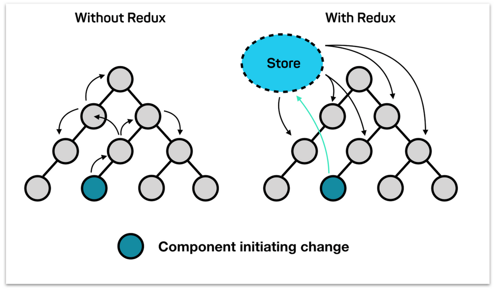

# Global State Management (전역상태관리) : Context

### Global context에서 state를 관리하지 않을 경우

왼쪽 사진에 보다시피 global에서 state 관리를 하지 않는 경우 다른 컴포넌트에게 해당 state를 전달하기 위해 여러차례 props를 전달해야한다. (이것을 props drilling이라고 부른다.)
우리가 앱을 만드는 경우 여러 개의 component를 만들 가능성이 크고 state 또한 동일한 state를 다른 component에서 사용할 가능성이 크다. 이럴 때 global에서 state 관리에 대한 필요성을 느낄 것이다.

### Global context에서 state를 관리할 경우

오른쪽 사진에 보다시피 기존의 문제점을 해결 하기 위해 Global Context에서 Store 객체에 state들을 모아두고 필요한 component마다 연결하여 쉽게 사용할 수 있다. 그렇지만 **component의 재사용이 어렵고, unit test 작성이 어렵다.**(function 밖 state에 영향을 받기 때문에 mocking을 해서 해결해야한다.)
**주의할 점: 상황에 따라 context를 사용하는 것이 배보다 배꼽이 커지는 상황이 될 수 있으므로 props를 쓰는 방향도 고려해 봐야한다. 리액트 공식문서에서 이야기 하고 있다.**

- [contextAPI](https://ko.reactjs.org/docs/context.html#before-you-use-context)
